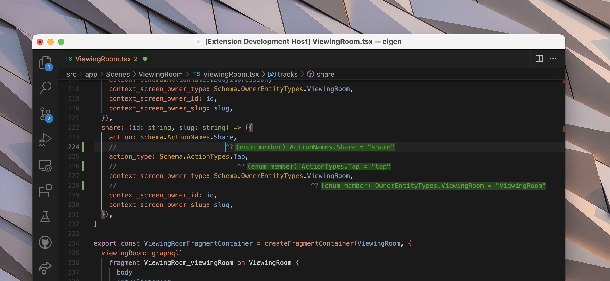

# vscode-twoslash-queries

A tiny (75LOC) extension for VS Code that lets you use `// ^?` inside your editor to inline highlight types. Re-uses the existing TypeScript tooling infra in `*.ts`, `*.tsx`, `*.js`, and `*.jsx` files, simply adding inline info.

Useful for keyboard warriors or folks working on complex types and want to see how changes propagate throughout other types.

**Ensure that inlay hints are enabled in your VS Code settings.**

## Features

You write `// ^?` anywhere in a source file (with whitespace before, between and middle being whatever) all that matters is the alignment of the `^`.

You can see here it in use a few times:

